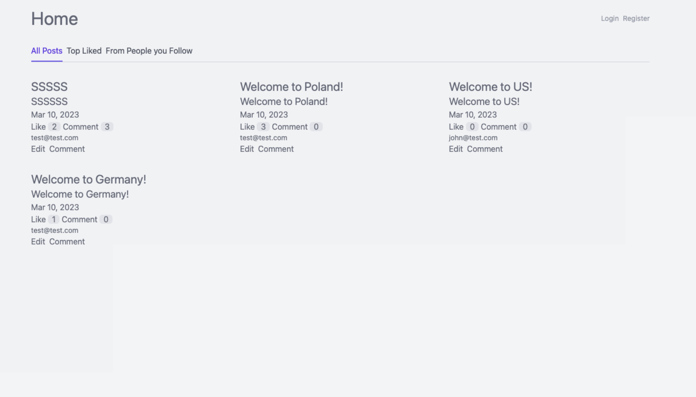
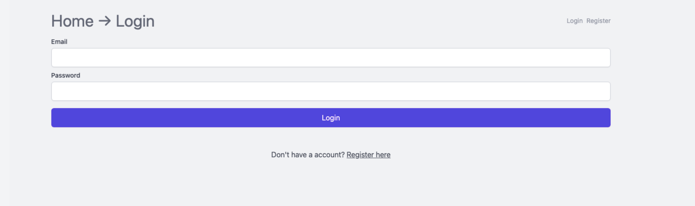

## This Project is part of the Udemy Symfony 6 Class

See: [Symfony 6 Framework Hands-On 2023](https://www.udemy.com/share/106VZe3@TqNBQ_R8vEK15tlO3coTmCpRQzVk-Ci9sG-PMSWD8x15VSenXWXwmjtD2ui0PN2n/)

The class was centered around an Introduction to the Symfony framework where we created a Full Stack Web App.

Implemented are:
    - DatabaseImmplementation with Symfony Query Builder
    - User Login / Registration with E-Mail Confirmation
    - Adding Post / Editing Post
    - Add User Profile / Edit User Profile
    - Uploading and Handling Images
    - Following Users 
    - Templating with Twig
    - Stylping with Tailwind CSS

**Home Screen:**

**Home Screen Dark Mode:**

**Post Detail Screen:**

**LogIn Form:**

**Profile Settings:**

**Profile Image Uplaod:**
